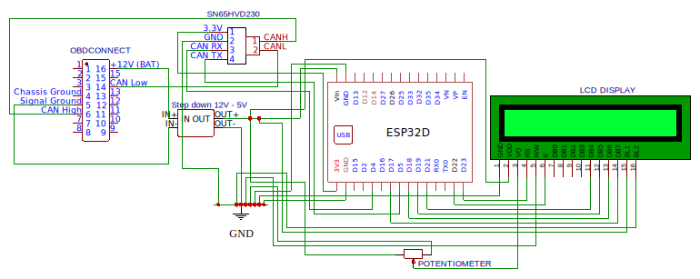
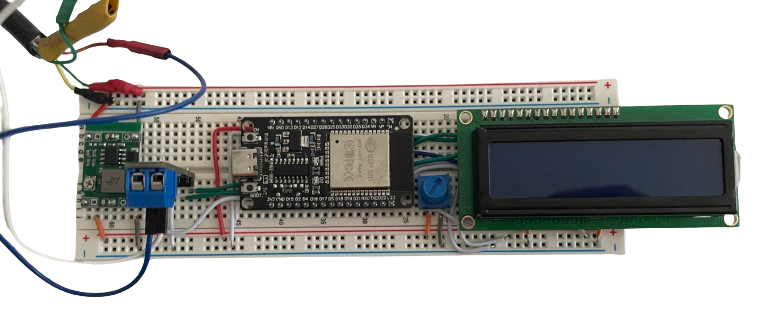
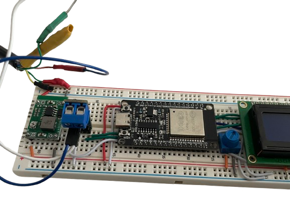

# OBD CAN Monitor: ESP32 CAN Bus Communication + HTTP JSON Web Server

### High-Performance Embedded Dashboard & Real-time JSON Streaming

OBD CAN Monitor is an embedded system project developed for Embedded Systems for IoT course at University of Trento.

The device reads CANH and CANL signals from a vehicle OBD-II port using an ESP32 and exposes real-time vehicle data through a local web dashboard.

The system is fully self-contained: the ESP32 acts as a WiFi Access Point and hosts the web interface directly from flash memory.

---

## Project Overview

The system performs the following operations:

- **Reads OBD-II PIDs** from the vehicle CAN bus
- **Processes and decodes** raw CAN frames
- **Stores and updates** structured OBD data
- **Exposes data as JSON** through an HTTP server
- **Displays real-time KPIs**, charts, and diagnostics via a local web interface

The device creates its own WiFi Access Point. Users connect to it and access the dashboard via a browser.

---

## System Architecture

High-level data flow:
**CAN Bus → Scheduler → OBD Processing → JSON Serialization → Web Server → Browser Dashboard**

### Main Components

- **CAN Module**: Handles low-level CAN communication with the vehicle.
- **OBD Module**: Decodes OBD-II PIDs and maintains structured vehicle data.
- **Scheduler**: Periodically polls selected PIDs and updates internal data.
- **Web Server**: Hosts HTML, CSS, JavaScript, and provides JSON endpoints.
- **Web Dashboard**: Displays real-time KPIs, animations, and historical charts.

---

## Repository Structure

Main project structure:

```text
assets/
README.md
docs.pdf
CMakeLists.txt
partitions.csv
main/
├── CMakeLists.txt
├── app_main.c
│
├── can/
│   ├── can_bus.c
│   └── can_bus.h
│
├── obd/
│   ├── obd.c
│   ├── obd.h
│   └── obd_data.c
│
|
├── lcd/
│   ├── lcd.c
│   ├── lcd.h
|
├── web/
    ├── web_server.c
    ├── web_server.h
    │
    ├── index.html
    ├── graph.html
    ├── errors.html
    ├── diagnostics.html
    ├── script.js
    ├── style.css
    │
    ├── js/
    │   ├── chart-script.js
    │   ├── animations.js
    │   └── diagnostics-script.js
    │
    ├── lib/
    │   ├── chart.js
    │   └── luxox.js
    │
    └── fonts/
        ├── font-awesome/
        │   ├── css/
        │   │   └── all.min.css
        │   └── webfonts/
        │       ├── fa-solid-900.woff2
        │       ├── fa-regular-400.woff2
        │       └── fa-brands-400.woff2
        │
        ├── Inter-Bold.woff2
        └── Inter-Regular.woff2

```

All web assets are embedded directly into the firmware using the ESP-IDF embed mechanism.

---

## Build System

The project is built using **ESP-IDF** and **CMake**.
The CMake configuration:

1. Registers all C source files
2. Defines include directories
3. Declares required ESP-IDF components
4. Embeds all web resources into flash memory

**Required ESP-IDF components:** `esp_http_server`

- `esp_wifi`
- `esp_netif`
- `esp_event`
- `nvs_flash`
- `driver`
- `lwip`

---

## Hardware Setup

### Electrical Schematic



### Hardware Implementation

Below are photos of the complete hardware assembly, including the ESP32, CAN Transceiver, and connections.

|           Top View            |       Breadboard Wiring       |
| :---------------------------: | :---------------------------: |
|  |  |

---

## Partition Table

The project uses a custom partition table including:

- **nvs**: for non-volatile storage
- **otadata**: for OTA support
- **phy_init**: for WiFi PHY initialization
- **factory**: application partition (3MB)
- **spiffs**: storage partition

The factory partition is intentionally set to **3MB** to ensure enough space for embedded web assets, charting libraries, and UI resources.

---

## Web Interface

The dashboard provides:

- Real-time engine RPM & Vehicle speed
- Coolant and intake temperatures
- Engine load and throttle position
- Fuel level and fuel trims
- Battery voltage
- Interactive charts and diagnostic information

**JavaScript Module Logic:** `script.js`: manages core data updates

- `chart-script.js`: handles chart visualization
- `animations.js`: controls UI animations

---

## Documentation

For a complete technical deep-dive, please refer to the project documentation file included in this repository.

The **`docs.pdf`** file contains detailed information on:

- **Software Stack**: Full breakdown of the libraries and ESP-IDF components used.
- **Software Architecture**: In-depth explanation of the system design and data flow.
- **Module Dependencies**: Relations between the C files (main, obd, can, web).

📄 **[Read the Full Documentation (docs.pdf)](docs.pdf)**

---

## Requirements

### Hardware

- **ESP32** **CAN transceiver** (e.g., MCP2551 or SN65HVD230)
- **OBD-II connector** 12V vehicle power supply

### Software

- **ESP-IDF** (latest stable version)
- **CMake** **Python** (for ESP-IDF tooling)

---

## How to Build and Flash

1. **Install ESP-IDF**
2. **Clone this repository**
3. **Configure target**:
   ```bash
   idf.py set-target esp32
   ```
4. **Project Configuration**:
   Run the configuration menu:
   ```bash
   idf.py menuconfig
   ```
   * Navigate to **Partition Table**:
     * Select **Custom partition table CSV**.
     * Set the filename to `partitions.csv`.
   * Navigate to **Serial Flasher Config**:
     * Set **Flash Size** to **4MB**.
   * Press `Q` and then `Y` to save and exit.
5. **Build**:
   ```bash
   idf.py build
   ```
6. **Flash**:
   ```bash
   idf.py flash monitor
   ```

**Connection Details:** **SSID**: `OBD_CAN_MONITOR`

- **Password**: `12345678`
- **DASHBOARD URL**: `http://192.168.4.1`

---
## Disclaimer

This project is **fully functional** and tested in its default configuration.

However, please be aware that **improper modifications** to the source files or the electronic hardware setup can lead to anomalous and harmful behavior.

**CRITICAL WARNING:** Incorrect wiring or hardware configuration poses a significant risk of **short circuits** to the vehicle's power supply. Ensure all electronic connections are verified and compliant before connecting to the vehicle.

---

## Authors

Developed as part of an Embedded Systems for IoT course project - Group 35
